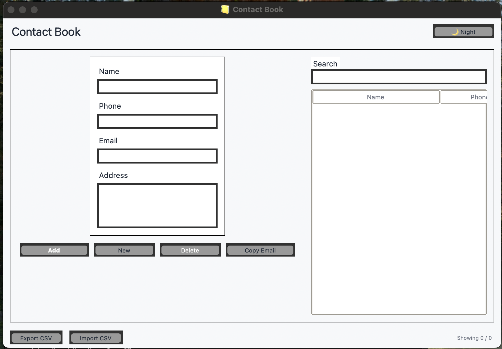
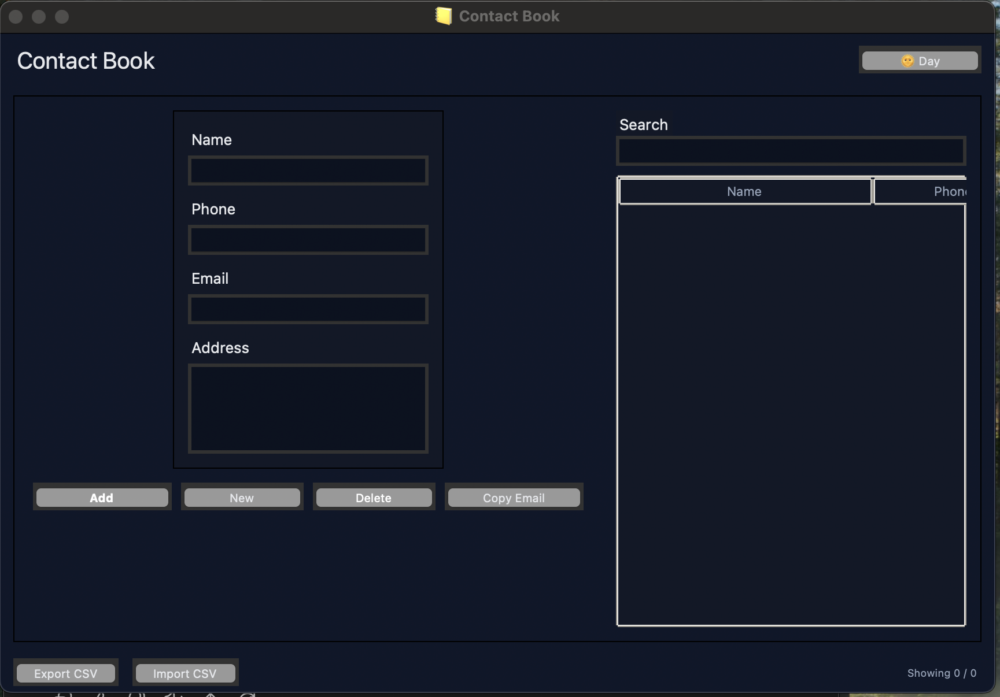

# 📒 Contact Book (CodSoft Task 05)

This project was completed as part of my **Python Programming Internship** at **CodSoft** (Task 05).
The objective of this task was to create a **Contact Book Application** that helps users store, manage, and organize contact details easily.

---

## 📌 Task Objective

Develop a **Contact Book Application** that allows users to:

* Add new contacts with **Name, Phone, Email, and Address**.
* View all saved contacts in a structured way.
* Search for specific contacts by name or phone number.
* Update existing contact information.
* Delete contacts when no longer needed.

---

## 🛠️ Technologies Used

* **Python 3** – Core programming language
* **Tkinter** – For building the GUI
* **JSON** – To store and retrieve contact data

---

## 📁 Project Structure

```
contact_book/
├── contact_book.py        # Main program with GUI  
├── contacts.json          # JSON file for storing contact data  
├── README.md              # Project overview and instructions  
```

---

## 🖼️ UI

 

  

---

## 🖥️ How to Run

1. Clone the repository or download the files.

```bash
git clone https://github.com/your-username/contact-book.git
```

2. Install Python (if not already installed).

3. Run the program:

```bash
python contact_book.py
```

4. The Contact Book GUI will open, and you can start managing contacts.

---

## 🔧 Future Enhancements

* Add password protection / authentication.
* Export contacts to **Excel/CSV**.
* Add profile photos for contacts.
* Cloud-based contact storage for multi-device access.

---

## 🎓 Internship & Task Details

* **Internship Track**: Python Programming
* **Internship Provider**: CodSoft
* **Task Name**: Contact Book (Task 05)
* **Environment**: Python + Tkinter + JSON

---

## 📬 Contact

* **Name**: Difina George
* 📧 **Email**: [difina.georgecs@gmail.com](mailto:difina.georgecs@gmail.com)
* 📍 **Location**: Kerala, India
